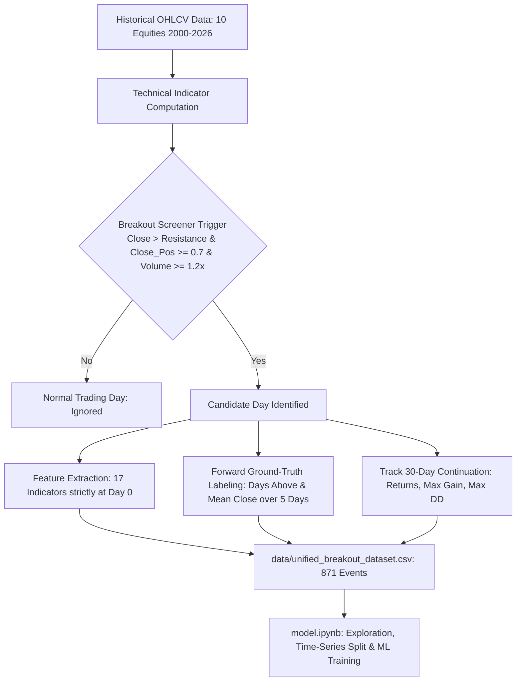

# 📈 Algorithmic Stock Breakout & Fakeout Detection Pipeline

An end-to-end quantitative research framework and machine learning pipeline to identify, label, and classify **price breakouts** vs. **fakeouts (bull traps)** across major US equities.

---

## 📌 Project Overview

In quantitative finance and momentum trading, buying new highs (breakouts) is one of the most profitable strategies, but it suffers from a major risk: **Fakeouts (Bull Traps)**, where prices briefly pierce resistance before reversing sharply into a steep loss.

This repository implements a rigorous quantitative pipeline that:
1. **Screens for potential breakouts** using multi-factor rules (Price clearance, Candle strength, Volume expansion).
2. **Defines unbiased ground-truth labels** (`breakout`, `fakeout`, `neutral/retest`) using a 5-day post-breakout forward horizon and tracks medium-term 30-day continuation.
3. **Engineers 17 predictive features** strictly at or before the breakout day ($t \le i$) with **zero lookahead bias**.
4. **Prepares a unified multi-asset benchmark dataset** across 10 large-cap US equities spanning 2000 to 2026.

---

## 🏗️ Architecture & Workflow



---

## 📊 Benchmark Dataset Summary (`data/unified_breakout_dataset.csv`)

The dataset comprises **871 validated breakout candidate events** across 10 large-cap stocks across sectors (AAPL, MSFT, AMZN, GOOGL, NVDA, TSLA, META, JPM, XOM, JNJ):

| Target Class | Count | Percentage | 5-Day Avg Return | 30-Day Avg Return | 30-Day Max Gain | 30-Day Max Drawdown | 30-Day Win Rate |
| :--- | :---: | :---: | :---: | :---: | :---: | :---: | :---: |
| **`breakout`** | **656** | **75.3%** | **`+2.29%`** | **`+6.29%`** | **`+14.54%`** | `-6.32%` | **`68.0%`** |
| **`fakeout`** | **130** | **14.9%** | **`-5.68%`** | **`-5.81%`** | `+4.32%` | **`-15.37%`** | **`28.5%`** |
| **`neutral/retest`** | **85** | **9.8%** | **`-1.68%`** | **`+0.61%`** | `+10.30%` | `-11.00%` | **`51.8%`** |

---

## 🧪 Feature Engineering (17 Predictive Day-0 Features)

All features are calculated **at or strictly before** the breakout day ($t \le i$). Forward-looking columns are quarantined strictly for evaluation:

1. **Price & Candle Microstructure**:
   - `Resistance_Distance_%`: Percentage clearance above the 30-day resistance.
   - `Close_Position`: Intraday candle strength $(\text{Close} - \text{Low}) / (\text{High} - \text{Low})$.
   - `Daily_Range_%`: Day's total candle range relative to price.
   - `Range_Ratio`: Today's range relative to the 10-day average range.
2. **Volume Dynamics**:
   - `Volume_Ratio`: Volume relative to 30-day average volume.
   - `Volume_Surge_10`: Volume relative to 10-day average volume.
3. **Momentum & Velocity**:
   - `Momentum_5d_%`, `Momentum_10d_%`, `Momentum_20d_%`: Rate of price change across multiple lookbacks.
4. **Trend & Moving Averages**:
   - `MA_Ratio`: Ratio of 10-day MA to 30-day MA ($\text{MA}_{10} / \text{MA}_{30}$).
   - `Distance_MA10_%`, `Distance_MA30_%`: Distance of closing price from short and intermediate moving averages.
5. **Volatility, Compression & Market Structure**:
   - `ATR_Pct`: Average True Range (14 days) normalized by stock price.
   - `Volatility_10d`: Standard deviation of past 10 daily returns.
   - `Price_Range_10d_%`: Consolidation tightness over the past 10 trading days.
   - `Resistance_Tests_30d`: Count of times price tested the resistance level ($\ge 98\%$) during the prior 30 days without leakage.
   - `RSI_14`: Relative Strength Index (14 periods).

---

## 📁 Repository Structure

```plaintext
├── data/
│   └── unified_breakout_dataset.csv  # 871 events x 30 columns (Features, Targets, Forward Trackers)
├── stock_data/                       # Raw daily OHLCV CSVs (AAPL, MSFT, AMZN, NVDA, etc.)
│   ├── AAPL.csv
│   ├── MSFT.csv
│   └── ...
├── project.ipynb                     # Data pipeline, indicator math, labeling logic & dataset creation
├── model.ipynb                       # Dataset exploration, feature correlation, time-series split & modeling
├── .gitignore                        # Python & Jupyter ignore rules
└── README.md                         # Documentation and overview
```

---

## 🚀 Quickstart & Usage

### 1. Clone the repository
```bash
git clone https://github.com/<your-username>/<repo-name>.git
cd <repo-name>
```

### 2. Install dependencies
```bash
pip install pandas numpy matplotlib seaborn yfinance
```

### 3. Explore the Notebooks
- Run `project.ipynb` to download fresh market data and rebuild the feature dataset.
- Run `model.ipynb` to inspect the dataset, examine correlation matrices, and train machine learning models.

---

## 🔮 Next Steps
- Train tree-based classifiers (**Random Forest**, **XGBoost**, **LightGBM**) with class-weight balancing.
- Evaluate models on the out-of-sample test set (2021–2026) using Precision, Recall, and AUC-ROC.
- Build an inference interface where users select a ticker, and the system screens the latest price bar and predicts breakout quality in real-time.

---

## 📜 License
MIT License. Feel free to use and modify for quantitative research and trading education.
