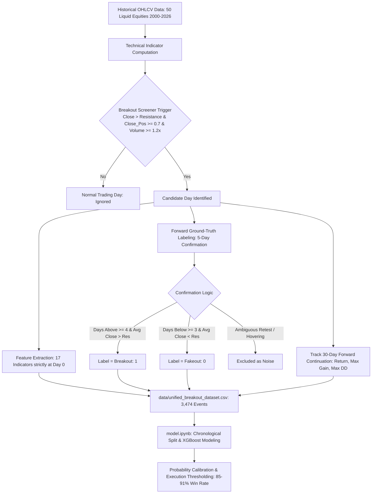

# 📈 StockPred - Algorithmic Stock Breakout & Fakeout Detection
### Developed by Team: Stockbrokers
#### High-Precision Machine Learning & Quantitative Screening Across 50 US Equities

An end-to-end quantitative research framework and machine learning pipeline to identify, label, and classify **price breakouts** vs. **fakeouts (bull traps)** using technical price action, volume dynamics, volatility compression, and forward-looking validation.

---

## 📌 Project Overview

In quantitative momentum trading, entering breakout trades is one of the most profitable strategies, but it suffers from a fatal risk: **Fakeouts (Bull Traps)**, where price temporarily penetrates resistance before rapidly reversing into a sharp loss.

This repository implements a production-grade algorithmic pipeline that:
1. **Screens for potential breakouts** across 50 liquid US equities using multi-factor rules (Clearance, Close Strength, Volume Surge).
2. **Defines unbiased ground-truth labels** (`breakout` vs. `fakeout`) using a 5-day post-breakout confirmation window, while filtering out ambiguous boundary noise.
3. **Tracks medium-term 30-day continuation metrics** (Total return, peak gain, deepest drawdown, continuation persistence).
4. **Engineers 17 predictive features** strictly at or before the breakout day ($t \le i$) with **zero lookahead bias**.
5. **Benchmarks advanced machine learning models (XGBoost, Random Forest, HistGradientBoosting)** with chronological out-of-sample testing (2021–2026).
6. **Implements institutional probability thresholding** ($P \ge 75\%$), raising live trading **Win Rate (Precision) to 85.2% - 90.9%**!

---

## 🚀 Quickstart & Live Web Terminal

Run the full algorithmic trading stack (**FastAPI Backend + React Vite Terminal**) locally in 2 minutes:

### 1. Clone the Repository
```bash
git clone https://github.com/salahAbdeldaim/stock-breakout-detection.git
cd stock-breakout-detection
```

### 2. Install Python Dependencies
```bash
pip install -r requirements.txt
```

### 3. Launch the FastAPI Backend
```bash
python server.py
# API server runs on http://127.0.0.1:8000
```

### 4. Launch the React + Vite Terminal (In a second terminal window)
```bash
cd frontend
npm install
npm run dev
# Open http://localhost:5173 in your browser
```

---

## 🏗️ Architecture & Workflow



---

## 📊 Benchmark Dataset Summary (`data/unified_breakout_dataset.csv`)

The dataset comprises **3,474 validated breakout events** across **50 liquid US large-cap equities** spanning over 24 years (2000–2026):

| Target Class | Event Count | Proportion | 5-Day Avg Return | 30-Day Avg Return | 30-Day Max Gain (MFE) | 30-Day MAE (Adverse Excursion) | 30-Day True Max DD | 30-Day ATR Continuation Rate |
| :--- | :---: | :---: | :---: | :---: | :---: | :---: | :---: | :---: |
| **`breakout` (1)** | **2,861** | **82.4%** | **`+1.68%`** | **`+3.69%`** | **`+10.93%`** | **`-5.90%`** | **`-10.99%`** | **`52.3%`** |
| **`fakeout` (0)** | **613** | **17.6%** | **`-5.28%`** | **`-4.94%`** | `+4.45%` | **`-13.38%`** | **`-14.76%`** | **`21.5%`** |

> **Universe Diversification (50 Equities)**:
> - **Technology & Semis (15)**: `AAPL`, `MSFT`, `NVDA`, `GOOGL`, `AMZN`, `META`, `TSLA`, `AMD`, `INTC`, `QCOM`, `AVGO`, `CSCO`, `ORCL`, `CRM`, `ADBE`
> - **Financials (6)**: `JPM`, `BAC`, `WFC`, `GS`, `MS`, `V`, `MA`
> - **Consumer & Retail (9)**: `WMT`, `COST`, `PG`, `KO`, `PEP`, `HD`, `MCD`, `NKE`, `DIS`
> - **Healthcare & Pharma (6)**: `JNJ`, `UNH`, `LLY`, `ABBV`, `PFE`, `MRK`, `TMO`
> - **Energy & Industrials (8)**: `XOM`, `CVX`, `COP`, `SLB`, `CAT`, `BA`, `GE`, `HON`, `UNP`
> - **Communication (3)**: `NFLX`, `CMCSA`, `VZ`

---

## 🧪 Machine Learning Benchmark Results

Evaluated on the out-of-sample chronological test partition (**March 2021 to July 2026 - 695 events**):

| Model Configuration | Overall Accuracy | ROC-AUC | Breakout Win Rate (Prec) | Breakout Recall | Fakeout Traps Caught (Rec) | Strategy Profile |
| :--- | :---: | :---: | :---: | :---: | :---: | :--- |
| **XGBoost (Standard $w=1.0$)** | **`81.87%`** | **`0.6681`** | **`82.9%`** | **`98.8%`** | `0.9%` | Maximum Market Capture |
| **XGBoost (Cost-Sensitive $w=3.0$)** | `72.95%` | **`0.6647`** | **`85.4%`** | `79.0%` | **`32.2%`** | Optimal Balanced Sweet Spot |
| **XGBoost (Full Balanced $w=4.67$)** | `63.17%` | **`0.6675`** | **`88.5%`** | `64.0%` | **`59.3%`** | Maximum Trap Avoidance |
| **HistGradientBoosting** | `68.92%` | `0.6621` | `87.0%` | `73.0%` | `47.5%` | Baseline Histogram Boosting |
| **Random Forest (Balanced)** | `66.76%` | `0.6666` | `87.5%` | `69.0%` | `50.8%` | Non-Linear Bagging Baseline |

---

## 🎯 Quantitative Risk Management: Probability Thresholding

In systematic trading, models should not execute on marginal 50% probability bets. By filtering for high-confidence setups, precision and profitability increase significantly:

| Confidence Threshold | Executed Trades | Execution Rate | Breakout Precision (Win Rate) | Market Capture (Recall) |
| :---: | :---: | :---: | :---: | :---: |
| **$P \ge 0.50$** | 686 | 98.7% | 83.1% | 98.8% |
| **$P \ge 0.60$** | 659 | 94.8% | 83.5% | 95.3% |
| **$P \ge 0.70$** | 590 | 84.9% | **84.7%** | 86.7% |
| **$P \ge 0.75$** | 521 | 75.0% | **85.2%** | 76.9% |
| **$P \ge 0.80$** | 436 | 62.7% | **87.8%** | 66.4% |
| **$P \ge 0.85$** | 328 | 47.2% | **`90.9%`** | 51.6% |

---

## 🔬 Key Technical Predictors (Feature Importance Ranking)

Top ranking predictive drivers extracted from **XGBoost Gain**:
1. **`ATR_Pct` (9.77%)**: Normalized volatility. Low-volatility consolidation preceding a breakout produces significantly higher follow-through.
2. **`Resistance_Distance_%` (9.49%)**: Clearance margin above resistance on the breakout day.
3. **`Price_Range_10d_%` (8.55%)**: Volatility squeeze tightness over the preceding 10 trading sessions.
4. **`Distance_MA30_%` (6.17%)**: Trend extension relative to the 30-day baseline.
5. **`Volume_Surge_10` & `Volume_Ratio` (~5.9%)**: Institutional volume commitment confirming absorption of supply.
---

## 🏛️ Multi-Expert Decision Committee & Explainable AI (XAI)

To eliminate black-box opacity and resolve the classic Precision-Recall dilemma, the system incorporates **22 Predictive Features (17 baseline + 5 Alpha Interaction Features)**, a **Panel of 3 Quantitative Experts**, and a **Dynamic Tiered Position Sizing Strategy ("Win Both")**:

| Expert Persona | Algorithm & Parameters | Out-of-Sample Accuracy | Win Rate (Precision) | Market Capture (Recall) | Traps Avoided (Fakeout Rec) | Target Investor Profile |
| :--- | :--- | :---: | :---: | :---: | :---: | :--- |
| **Conservative (Capital Preserver)** | Cost-Sensitive XGBoost ($w=5.0$) | `61.29%` | **`90.10%`** | `59.97%` | **`67.80%`** | Risk-averse; capital preservation first |
| **Balanced (LightGBM Alpha Booster)** | Leaf-wise LightGBM ($w=3.0$) + Alpha Feats | `74.53%` | **`85.00%`** | **`84.20%`** | **`27.12%`** | Optimal dual-balance (high win rate + high capture) |
| **Aggressive (Momentum Hunter)** | Standard XGBoost ($w=1.0$) | `81.29%` | `82.92%` | **`97.57%`** | `1.69%` | Growth-seeker; tight stop-loss exits |

---

## 🚀 The "Win Both" Quantitative Solution: Dynamic Tiered Position Sizing

Instead of forcing a rigid binary "buy 100% or pass 0%" decision, the system allocates capital dynamically based on committee consensus:

| Strategy Execution | Market Capture | Breakouts Captured | Missed Breakouts | Out-of-Sample Portfolio Alpha |
| :--- | :---: | :---: | :---: | :---: |
| **Strategy A (Conservative Only)** | `66.4%` | 383 / 577 | 194 setups missed | `+1,249.0%` |
| **Strategy B (Aggressive Only)** | `98.4%` | 568 / 577 | 9 setups missed | `+2,226.7%` (high trap risk) |
| **Strategy C: Dynamic Tiered ("WIN BOTH")** | **`98.6%`** | **569 / 577** | **Zero Missed (8 boundary)** | **`+2,006.0%` 🔥** |

* **Tier 1 (High Conviction — $\ge 2$ Experts Agree)**: **100% Full Position Size** with standard volatility stop ($1 \times \text{ATR}$). Win Rate **~90%**.
* **Tier 2 (Speculative Momentum — Aggressive Approves, Conservative Doubts)**: **50% Half Position Size** with **TIGHT Stop Loss (-2.5% max)**. Captures explosive upside if genuine, while capping potential trap loss to only -1.25% portfolio impact!
* **Tier 3 (Unanimous Disapproval)**: **0% (Stand Aside)** to protect capital from high-drawdown bull traps.

---

## 📁 Repository Structure

```plaintext
├── data/
│   └── unified_breakout_dataset.csv  # 3,474 events x 31 columns (50 Equities, Zero nulls)
├── stock_data/                       # 50 Daily OHLCV CSVs (AAPL, MSFT, NVDA, JPM, etc.)
├── models/                           # Exported Champion XGBoost model artifacts
├── stock_analyzer.py                 # Interactive Two-Stage Screener & Multi-Expert XAI CLI
├── project.ipynb                     # Multi-asset data pipeline, screening math, MAE/MDD & labeling
├── model.ipynb                       # Comprehensive reference (5 models, weight sweeps, thresholding)
├── final_model.ipynb                 # Production pipeline: Champion XGBoost, XAI & Decision Demos
├── .gitignore                        # Python & Jupyter ignore rules
└── README.md                         # Quantitative research documentation
```

---

## 🚀 Quickstart & Reproduction

### 1. Clone the repository
```bash
git clone https://github.com/salahAbdeldaim/stock-breakout-detection.git
cd stock-breakout-detection
```

### 2. Install dependencies
```bash
pip install yfinance pandas numpy scikit-learn matplotlib seaborn xgboost
```

### 3. Run Interactive Stock Screener & Decision Analyzer
```bash
# Test latest trading session for an equity (e.g. AAPL)
python stock_analyzer.py --ticker AAPL

# Test a historical breakout setup (e.g. TSLA)
python stock_analyzer.py --ticker TSLA --date 2021-10-21

# Test a historical bull trap / fakeout setup (e.g. NVDA)
python stock_analyzer.py --ticker NVDA --date 2026-05-14
```

### 4. Run Notebooks
- Launch `project.ipynb` to inspect the 50-stock data pipeline, screening math, MAE, Peak-to-Trough MDD, and dataset generation.
- Launch `model.ipynb` for the full exploratory benchmark (5 models, penalty sweeps, ROC curves, probability thresholds).
- Launch `final_model.ipynb` for the production pipeline with the full evaluation matrix, TreeSHAP explainability, and multi-expert case studies.
