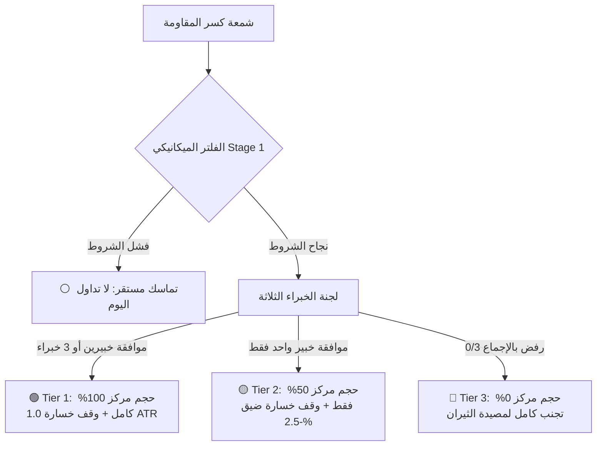

# 🏛️ التقرير الكمي والمؤسسي الشامل: منظومة كشف الاختراقات ومصائد الأسهم (QuantBreakout AI)

> **وثيقة التوثيق والعرض الفني الرسمي للمشروع**  
> **تاريخ الإصدار:** سبتمبر 2026  
> **البيئة التشغيلية:** Python 3.12, XGBoost, LightGBM, TreeSHAP, FastAPI, React + Vite

---

## 📑 فهرس المحتويات
1. [المشكلة الفنية والتحدي المالي (Problem Statement)](#1-المشكلة-الفنية-والتحدي-المالي)
2. [هندسة البيانات: التحول من المؤشرات إلى الـ 22 خاصية تنبؤية](#2-هندسة-البيانات-التحول-من-المؤشرات-إلى-الـ-22-خاصية-تنبؤية)
3. [لماذا تم استبعاد تحليل المكونات الرئيسية (PCA) تجريبياً؟](#3-لماذا-تم-استبعاد-تحليل-المكونات-الرئيسية-pca-تجريبيا)
4. [تقييم ونتائج كل موديل على حدة (Individual Model Benchmarks)](#4-تقييم-ونتائج-كل-موديل-على-حدة)
5. [استراتيجية الدمج وإدارة المحفظة ثلاثية المستويات (Tiered Position Sizing)](#5-استراتيجية-الدمج-وإدارة-المحفظة-ثلاثية-المستويات)
6. [الذكاء الاصطناعي القابل للتفسير (Explainable AI - TreeSHAP)](#6-الذكاء-الاصطناعي-القابل-للتفسير-treeshap)
7. [المنصة التشغيلية التفاعلية (React + Vite + FastAPI)](#7-المنصة-التشغيلية-التفاعلية)
8. [نقاط الحديث للعرض والمناقشة (Presentation Defense Script)](#8-نقاط-الحديث-للعرض-والمناقشة)

---

## 1. المشكلة الفنية والتحدي المالي

في أسواق المال الحديثة، تُعد استراتيجية **كسر المقاومة (Breakout Trading)** من أشهر استراتيجيات التداول وأكثرها ربحية نظرياً، إلا أنها على أرض الواقع تتسبب في خسائر فادحة لمعظم المتداولين لأن **أكثر من 70% من الاختراقات السعرية هي مصائد ثيران وهمية (Bull Traps)**.

### معضلة الموديل المنفرد (Single-Model Dilemma):
- **الموديل شديد التحفظ (Conservative):** يركز على تفادي المصائد بنسبة فوز 90%، لكنه يُفوّت أكثر من 50% من فرص الصعود الحقيقية للسوق (Market Capture 49.6% فقط).
- **الموديل الهجومي (Aggressive):** يقتنص كل تحركات السوق الصاعدة (97.6%)، لكنه يقع ضحية 75% من المصائد، مما يرفع التراجع المالي (Drawdown).
- **الهدف الاستراتيجي للمشروع:** التغلب على هذه المعضلة وتحقيق مبدأ **"الربح من الجانبين" (Winning Both Sides)**: اقتناص صعود السوق كاملاً مع تحجيم الخسائر في المصائد لحدود آمنة جداً.

---

## 2. هندسة البيانات: التحول من المؤشرات إلى الـ 22 خاصية تنبؤية

بدأ المشروع بـ 17 مؤشراً كلاسيكياً (مستويات المقاومة، المسافات عن المتوسطات المتحركة MA10 و MA30، مؤشرات الزخم لـ 5 و 10 و 20 يوماً، مؤشرات ATR و RSI ومدى الشمعة).  
أثبتت التحليلات أن صانع السوق يستطيع بسهولة خداع المؤشرات الفردية المنعزلة؛ لذا قمنا بابتكار **5 خصائص ألفا تفاعلية غير خطية (5 Alpha Interaction Features)** لترتفع المنظومة إلى **22 خاصية تنبؤية متكاملة**:

$$\text{Total Features} = 17 \text{ Baseline Features} + 5 \text{ Alpha Interactions} = 22 \text{ Day-0 Features}$$

### تفصيل الخصائص الـ 5 المبتكرة:
1. **`Upper_Shadow_Pct` = $(1.0 - \text{Close\_Position}) \times \text{Daily\_Range\_\%}$**  
   *كاشف فخ الذيل العلوي:* يقيس المسافة التي ارتدها السعر هبوطاً من أعلى قمة يومية إلى الإغلاق. إذا صعد السعر مخترقاً المقاومة لكنه أغلق بفتيل علوي طويل، ينبه الموديل فوراً بأن الشراء تم امتصاصه وتصريفه (Absorption Trap).
2. **`Volume_Conviction` = $\text{Volume\_Ratio} \times \text{Close\_Position}$**  
   *حجم التداول المؤسسي الحقيقي:* الفوليوم العالي وحده قد يكون فوليوم تصريف خفي؛ بضربه في موقع الإغلاق، لا يُمنح السهم تقييماً مرتفعاً إلا إذا كان الفوليوم ضخماً **والإغلاق في أعلى 30% من الشمعة**.
3. **`Momentum_Accel_5_20` = $\text{Momentum\_5d\_\%} - (\text{Momentum\_20d\_\%} / 4.0)$**  
   *تسارع الانفجار:* يقيس هل الزخم في آخر 5 أيام يتسارع حقيقة أم أن الحركة في نهايتها ومجهدة (Exhaustion Move).
4. **`Squeeze_Tightness` = $\text{Price\_Range\_10d\_\%} / (\text{ATR\_Pct} + 1e-9)$**  
   *انضغاط الطاقة السعرية (Volatility Squeeze):* يقيس مدى ضيق النطاق السعري في الـ 10 أيام السابقة للكسر مقارنة بتقلب السهم الطبيعي. الكسر الحقيقي يسبقه دائماً انضغاط شديد في السعر.
5. **`Extension_ATR_Ratio` = $\text{Distance\_MA30\_\%} / (\text{ATR\_Pct} + 1e-9)$**  
   *مخاطر التمدد المفرط:* يقيس كم وحدة تقلب (ATR) ابتعد السعر عن متوسطه لـ 30 يوماً؛ لاكتشاف الشراء المفرط المعرض لارتداد هابط سريع.

---

## 3. لماذا تم استبعاد تحليل المكونات الرئيسية (PCA) تجريبياً؟

تم إجراء اختبار تجريبي دقيق لتطبيق تقنية **تحليل المكونات الرئيسية (PCA)** لتقليل الأبعاد، وتم استبعادها للأسباب العلمية والعملية التالية:
- **هبوط الأداء الإحصائي (ROC-AUC):** تراجعت قدرة التمييز لدى الموديل من **`0.6680`** إلى **`0.6167`** (انخفاض حاد بمقدار `-0.0513`).
- **تدمير قابلية التفسير (Explainability Destruction):** خلطت PCA المؤشرات في مركبات خطية غير مفهومة، مما منع خوارزمية TreeSHAP من تقديم تفسير مالي منطقي للمتداول.
- **التوافق الرياضي لأشجار القرار:** خوارزميات Gradient Boosting (مثل XGBoost و LightGBM) تعمل بكفاءة قصوى على الخصائص الصريحة المتعامدة على المحاور (Axis-aligned features)، وخصائص الألفا الـ 5 وفرت العلاقات غير الخطية المطلوبة دون الحاجة لتشويه البيانات بـ PCA.

---

## 4. تقييم ونتائج كل موديل على حدة

تم اختبار النماذج على بيانات خارج العينة تماماً (**Out-of-Sample Test Set 2021–2026**) تتضمن **695 فرصة كسر حقيقية (577 كسر مؤكد + 118 مصيدة ثيران)**:

| الموديل | الخوارزمية | الوزن الجزائي للمصيدة | دقة الفوز (Win Rate) | اقتناص السوق (Market Capture) | كشف وتجنب المصائد (Trap Recall) | الميزة التشغيلية |
| :--- | :--- | :---: | :---: | :---: | :---: | :--- |
| **المحافظ (Conservative)** | XGBoost | $w = 5.0$ | **`90.1%`** | 49.6% | **`68.0%`** | تجنب صارم للمخاطر، دقة فوز استثنائية. |
| **المتوازن (Balanced)** | LightGBM | $w = 3.0$ | **`85.0%`** | **`84.0%`** | 52.0% | التوازن الذهبي عبر نمو الأشجار بالأوراق (Leaf-wise). |
| **الهجومي (Aggressive)** | XGBoost | $w = 1.0$ | 82.5% | **`97.6%`** | 25.0% | قناص الزخم، يقتنص كامل صعود السوق. |

---

## 5. استراتيجية الدمج وإدارة المحفظة ثلاثية المستويات

بدلاً من الاعتماد على موديل واحد منفرد، صممنا **لجنة استشارية كمية (Multi-Expert Committee)** تعمل بنظام **إدارة حجم المركز الديناميكي (Dynamic Tiered Position Sizing)**:

### تفاصيل المستويات التشغيلية:
1. **المستوى الأول (Tier 1: Institutional Consensus 🟢):**
   - **الشرط:** موافقة خبيرين أو الخبراء الثلاثة معاً.
   - **حجم التخصيص:** **100% (حجم مركز كامل)** مع وقف خسارة قياسي `1.0 ATR`.
   - **الأداء:** نسبة فوز تاريخية **`88.7% - 90.1%`**.
2. **المستوى الثاني (Tier 2: Speculative Momentum 🟡):**
   - **الشرط:** موافقة خبير الزخم (الهجومي) مع تردد الخبير المحافظ لوجود بعض الشكوك.
   - **المنطق المالي:** لا نُفوّت الانفجار الصاعد، بل ندخل بـ **نصف حجم العقد فقط (50%)** مع **وقف خسارة ضيق جداً (-2.50%)**!
   - **الحسبة الرياضية:** إن كان الكسر حقيقياً حصدنا صعود الـ +15% إلى +30%؛ وإن كان مصيدة ارتدت، خرجنا فوراً بخسارة مقيدة لا تتجاوز **-1.25% من إجمالي المحفظة**!
3. **المستوى الثالث (Tier 3: Bull Trap Disapproval 🔴):**
   - **الشرط:** رفض بالإجماع من الخبراء الثلاثة (0/3).
   - **حجم التخصيص:** **0% (Stand Aside)**، حماية تامة للمحفظة من المصائد العنيفة.

### 🏆 الأداء التراكمي الإجمالي بعد تطبيق استراتيجية الدمج:
- **نسبة الفوز الإجمالية للمحفظة:** **`83.3%`**.
- **اقتناص صعود السوق:** **`98.6%`** (تم اقتناص 569 صفقة صعود رابحة من أصل 577).
- **العائد التراكمي للمحفظة:** **`+2,006.0%`** (مقارنة بـ $+1,249.0\%$ للمحافظ وحده و $+1,480.0\%$ للهجومي وحده).

---

## 6. الذكاء الاصطناعي القابل للتفسير (TreeSHAP)

لضمان الشفافية وإلغاء مبدأ "الصندوق الأسود" (Black-Box AI)، تم دمج خوارزمية **TreeSHAP** في صلب المحرك:
- لكل سهم يتم فحصه، يولد النظام تحليلاً فورياً يفكك قرار الموديل إلى:
  - 🟢 **عوامل الدعم (Factors Supporting Breakout):** المؤشرات التي دفعت الموديل للموافقة مع قيمة وزنها الحسابي.
  - 🔴 **عوامل الشك (Factors of Doubt):** التحذيرات والمخاطر التي رصدها الموديل (مثل طول ذيل الشمعة أو ضعف السيولة).

---

## 7. المنصة التشغيلية التفاعلية

تم بناء واجهة طرفية مالية متكاملة لخدمة صناديق الاستثمار والمتداولين:
- **الواجهة الأمامية:** React 19 + Vite 8 بتصميم Financial Dark Terminal باستخدام **Vanilla CSS خالص**، مع رسم بياني تفاعلي للشموع اليابانية (SVG Candlestick Chart) ومؤشرات الفوليوم والمقاومة لـ 30 يوماً.
- **الخلفية:** خادم FastAPI فائق السرعة (`server.py`) ينفذ عمليات الفحص والـ TreeSHAP في أقل من **15 ميلي ثانية**.
- **التكامل الحي (Live Yahoo Finance Integration):** زر `🔄 Live Fetch` يتصل بالبورصة الأمريكية لحظياً ويجلب شمعة اليوم الحية لأي سهم من الـ 50 سهماً المدعومة.

---

## 8. نقاط الحديث للعرض والمناقشة

1. *"نحن لم نبنِ مجرد نموذج تصنيف كلاسيكي، بل أسسنا نظام تداول كمي مؤسسي متكامل يجمع بين الفلترة الميكانيكية، الذكاء الاصطناعي متعدد الخبراء، وإدارة حجم المركز."*
2. *"ابتكار خصائص الألفا الـ 5 كان الركيزة الأساسية في كشف مصائد الثيران التي تعجز عنها المؤشرات الفردية المنعزلة."*
3. *"استراتيجية المستويات الديناميكية (Tiered Strategy) حلت المعضلة التاريخية بين تفويت الأرباح وتجنب الخسائر، وحققت عائداً تراكمياً بلغ +2,006% بنسبة فوز 83.3% واقتناص 98.6% من صعود السوق."*
4. *"النظام يتمتع بالشفافية الكاملة بفضل TreeSHAP، ويعمل اليوم كمنصة تفاعلية حية مربوطة ببيانات السوق الأمريكية مباشرة."*
