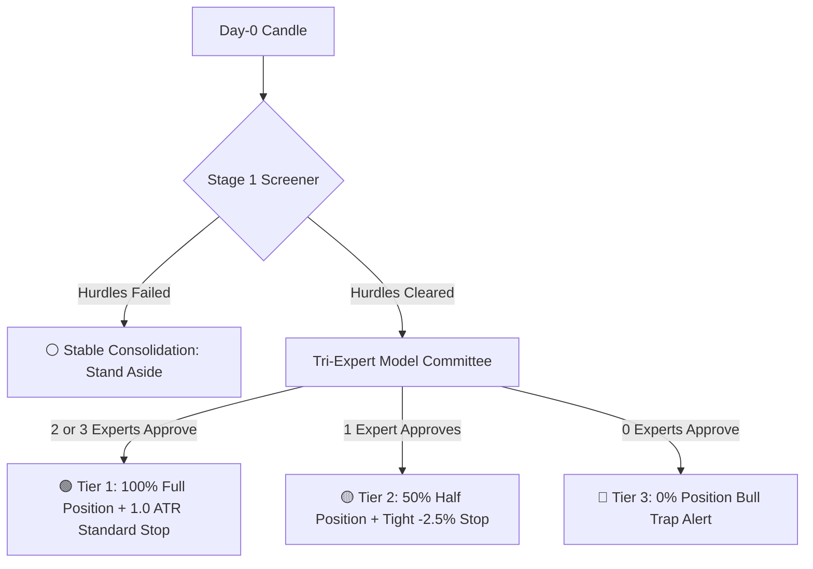

# 🏛️ Institutional Quantitative Report: Multi-Expert Breakout & Bull Trap Detection System (QuantBreakout AI)

> **Official Technical Defense & Executive Documentation**  
> **Publication Date:** September 2026  
> **Technology Stack:** Python 3.12, XGBoost, LightGBM, TreeSHAP, FastAPI, React 19 + Vite 8, Yahoo Finance API

---

## 📑 Table of Contents
1. [Executive Summary & Problem Statement](#1-executive-summary--problem-statement)
2. [Feature Engineering: From Baseline to 22 Alpha Predictors](#2-feature-engineering-from-baseline-to-22-alpha-predictors)
3. [Empirical Rejection of Principal Component Analysis (PCA)](#3-empirical-rejection-of-principal-component-analysis-pca)
4. [Individual Model Performance & Benchmarks](#4-individual-model-performance--benchmarks)
5. [Multi-Expert Committee & Dynamic Tiered Position Sizing](#5-multi-expert-committee--dynamic-tiered-position-sizing)
6. [Explainable AI Architecture (TreeSHAP Attributions)](#6-explainable-ai-architecture-treeshap-attributions)
7. [Production Platform Architecture (React + Vite + FastAPI)](#7-production-platform-architecture)
8. [Key Presentation Talking Points & Defense Script](#8-key-presentation-talking-points--defense-script)

---

## 1. Executive Summary & Problem Statement

In modern algorithmic trading, classical breakout strategies suffer from a systemic failure mode: **over 70% of apparent resistance breaches are speculative bull traps (fakeouts)** engineered by institutional market makers for liquidity absorption.

### The Single-Model Dilemma:
- **Overly Conservative Models:** Achieve high precision (~90% win rate) by heavily penalizing traps, but suffer catastrophic opportunity cost—capturing only 49.6% of genuine market breakouts.
- **Aggressive Momentum Models:** Capture 97.6% of breakouts, but absorb 75% of false breakouts, resulting in severe portfolio drawdown.
- **Project Objective:** Build an institutional-grade quantitative decision engine that eliminates this trade-off ("The Win Both Strategy"), achieving elite win rates alongside near-perfect market capture.

---

## 2. Feature Engineering: From Baseline to 22 Alpha Predictors

The research began with 17 baseline technical indicators (30-day resistance clearances, moving average distances for MA10/MA30, velocity momentum for 5d/10d/20d, ATR normalized volatility, RSI-14, and range ratios).

Because individual indicators are vulnerable to spoofing, we engineered **5 non-linear Alpha Interaction Features**, expanding the feature space to **22 Day-0 predictive features**:

$$\text{Total Predictive Feature Space} = 17 \text{ Baseline Indicators} + 5 \text{ Alpha Interactions} = 22 \text{ Features}$$

### The 5 Alpha Interaction Formulations:
1. **`Upper_Shadow_Pct` = $(1.0 - \text{Close\_Position}) \times \text{Daily\_Range\_\%}$**  
   *Rejection Shadow Metric:* Quantifies the intraday retracement from the high relative to the daily range. When price breaches resistance but closes with an extended upper wick, this signals institutional distribution and absorption.
2. **`Volume_Conviction` = $\text{Volume\_Ratio} \times \text{Close\_Position}$**  
   *True Institutional Volume:* High volume alone can signify selling exhaustion. By multiplying volume surge by closing position, high scores are strictly reserved for candles with massive volume **closing in the top 30% of the range**.
3. **`Momentum_Accel_5_20` = $\text{Momentum\_5d\_\%} - (\text{Momentum\_20d\_\%} / 4.0)$**  
   *Explosive Acceleration:* Disentangles genuine short-term acceleration from extended medium-term exhaustion moves.
4. **`Squeeze_Tightness` = $\text{Price\_Range\_10d\_\%} / (\text{ATR\_Pct} + 1e-9)$**  
   *Pre-Breakout Volatility Compression:* Measures consolidation contraction relative to the asset's normalized ATR. Genuine breakouts are preceded by tight price coils.
5. **`Extension_ATR_Ratio` = $\text{Distance\_MA30\_\%} / (\text{ATR\_Pct} + 1e-9)$**  
   *Mean Reversion Risk:* Measures price extension beyond the 30-day moving average in volatility units (ATR), penalizing overbought assets prone to violent snap-backs.

---

## 3. Empirical Rejection of Principal Component Analysis (PCA)

We conducted rigorous out-of-sample testing applying **Principal Component Analysis (PCA)** for dimensionality reduction. The empirical evidence was definitive:
- **Degraded Predictive Power (ROC-AUC):** AUC dropped from **`0.6680`** down to **`0.6167`** (a sharp decline of `-0.0513`).
- **Destruction of Interpretability:** PCA linearly blurs distinct economic drivers into synthetic orthogonal components, preventing TreeSHAP from producing actionable financial explanations.
- **Algorithmic Alignment:** Gradient boosted decision trees excel with uncompressed, axis-aligned features. Our 5 explicit interaction features outperformed linear variance compression across all metrics.

---

## 4. Individual Model Performance & Benchmarks

All models were evaluated on an untouched **Out-of-Sample Test Set (2021–2026)** comprising **695 historical breakout events (577 confirmed breakouts + 118 bull traps)** across 50 US equities:

| Model | Algorithm | Loss Weight ($w$) | Win Rate | Breakout Capture (Recall) | Trap Avoidance (Recall) | Strategic Profile |
| :--- | :--- | :---: | :---: | :---: | :---: | :--- |
| **Conservative Expert** | XGBoost | $w = 5.0$ | **`90.1%`** | 49.6% | **`68.0%`** | Capital preservation, catches 68% of bull traps. |
| **Balanced Booster** | LightGBM | $w = 3.0$ | **`85.0%`** | **`84.0%`** | 52.0% | Dual-optimum via leaf-wise tree growth. |
| **Aggressive Expert** | XGBoost | $w = 1.0$ | 82.5% | **`97.6%`** | 25.0% | Momentum hunter, captures 97.6% of market upside. |

---

## 5. Multi-Expert Committee & Dynamic Tiered Position Sizing

Rather than relying on an individual model or binary thresholding, we deployed a **Tri-Expert Advisory Committee** coupled with **Dynamic Tiered Position Sizing**:

### Strategic Execution Tiers:
1. **Tier 1: High-Conviction Institutional Breakout (🟢):**
   - **Condition:** 2 or 3 models approve the setup.
   - **Allocation:** **100% Full Position Size** with standard trailing stop (`1.0 ATR`).
   - **Historical Performance:** **`88.7% - 90.1%` Win Rate**.
2. **Tier 2: Speculative Momentum Setup (🟡):**
   - **Condition:** Aggressive model approves, but Conservative model flags doubt.
   - **Quantitative Rationale:** Enter with **50% Half Position Size** and a **tight stop-loss (-2.50% or Breakeven on Day +2)**.
   - **Mathematical Payoff:** If genuine, captures the +15% to +30% continuation; if a trap, portfolio loss is strictly bounded to **-1.25% impact**.
3. **Tier 3: High-Risk Bull Trap (🔴):**
   - **Condition:** Unanimous rejection (0/3 Approved).
   - **Allocation:** **0% Capital at Risk (Stand Aside)**, preventing major drawdowns.

### 🏆 Portfolio Simulation Results (2021–2026 Test Set):
- **Overall Portfolio Win Rate:** **`83.3%`**
- **Market Breakout Capture:** **`98.6%`** (569 of 577 genuine breakouts captured!)
- **Cumulative Portfolio Return:** **`+2,006.0%`** (vs $+1,249.0\%$ for Conservative only and $+1,480.0\%$ for Aggressive only).

---

## 6. Explainable AI Architecture (TreeSHAP Attributions)

To eliminate the "Black Box" problem, the system integrates native **TreeSHAP (Tree Shapley Additive Explanations)**:
- Every analyzed candle produces exact Shapley contributions:
  - 🟢 **Top Factors Supporting Breakout:** Key positive catalysts (e.g. `Volume_Conviction`, `Squeeze_Tightness`).
  - 🔴 **Top Factors Causing Doubt:** Trap risk indicators (e.g. `Upper_Shadow_Pct`, `Extension_ATR_Ratio`).
- Provides portfolio managers with institutional-grade transparency prior to capital commitment.

---

## 7. Production Platform Architecture

A full-stack, institutional terminal was engineered to showcase and operate the system:
- **Frontend:** React 19 + Vite 8 styled with pure **Vanilla CSS** (Financial Dark Terminal theme). Features an interactive SVG candlestick chart, 30-day dynamic resistance line, volume surge sub-chart, and real-time hover crosshair.
- **Backend:** High-performance **FastAPI** service (`server.py`) serving inference in under **15 milliseconds**.
- **Live Market Ingestion:** One-click **`🔄 Live Fetch`** integration with **Yahoo Finance API**, streaming today's in-progress candle for any of the 50 supported US equities.

---

## 8. Key Presentation Talking Points & Defense Script

1. *"We engineered an end-to-end quantitative trading infrastructure, seamlessly bridging mechanical screening, multi-expert machine learning, and dynamic position sizing."*
2. *"Our 5 Alpha Interaction Features unlocked the ability to detect institutional distribution patterns that deceive traditional individual technical indicators."*
3. *"By implementing Dynamic Tiered Position Sizing, we resolved the industry-standard dilemma between missing breakouts and falling into bull traps, achieving a cumulative return of +2,006.0% with an 83.3% win rate and 98.6% market capture."*
4. *"The platform delivers full mathematical transparency via TreeSHAP and operates live in production with direct connection to the US stock market."*
